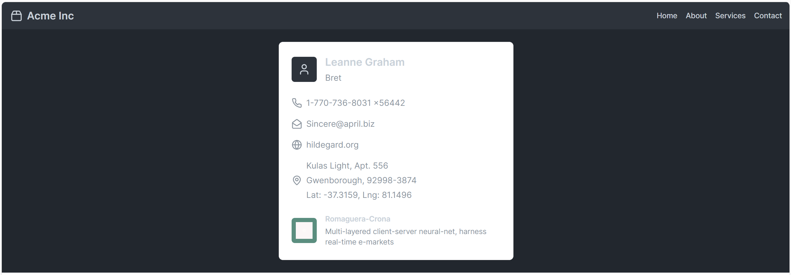

# Intro to fetch

In this example we will try and fetch some resources from an external API callad [Json Placeholder](https://jsonplaceholder.typicode.com/). We will also get some nice loaders from [Css Loaders](https://css-loaders.com/)

These resoruces will then be added to our application with some DOM manipulation. This is what we will build _( not from scratch though )_:

